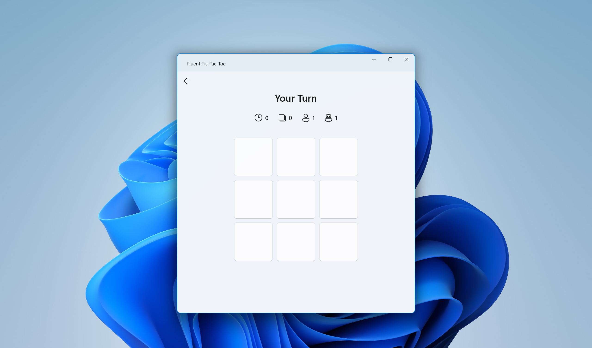
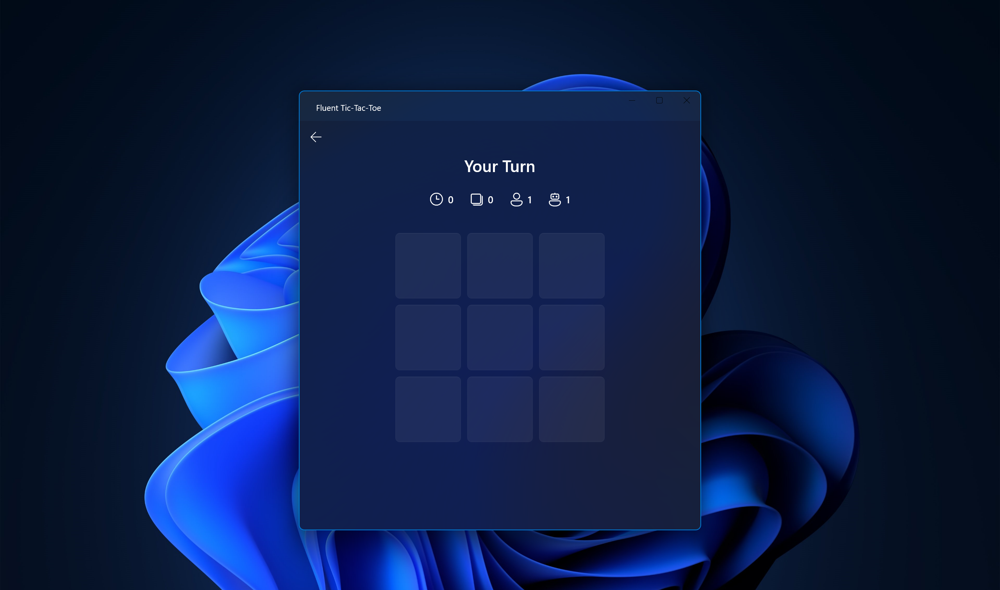

  

<h1 align="center">
  Fluent Tic-Tac-Toe
</h1>

  A Fluent-styled game of Tic-Tac-Toe for Windows.

  

---

## Installation

Get it from the [Microsoft Store](https://www.microsoft.com/store/apps/9NPFG5ZPGXZR)

## Screenshots

	
	

## Creator's note
This app started as a way for me to learn C# and xaml in order to build a desktop application using WinUI 3 and the .NET framework. As such, there are many obvious signs of inexperience when it comes to the app's code and functionality. If there's any feedback or advice on the project, feel free to contribute by reporting an [issue](https://github.com/dfchang149/Fluent-Tic-Tac-Toe/issues) or submitting a [pull request](https://github.com/dfchang149/Fluent-Tic-Tac-Toe/pulls).

## License
Copyright (c) 2022 Dustin Fu Chang

Licensed under [MIT license](https://github.com/dfchang149/Fluent-Tic-Tac-Toe/blob/master/LICENSE.md)